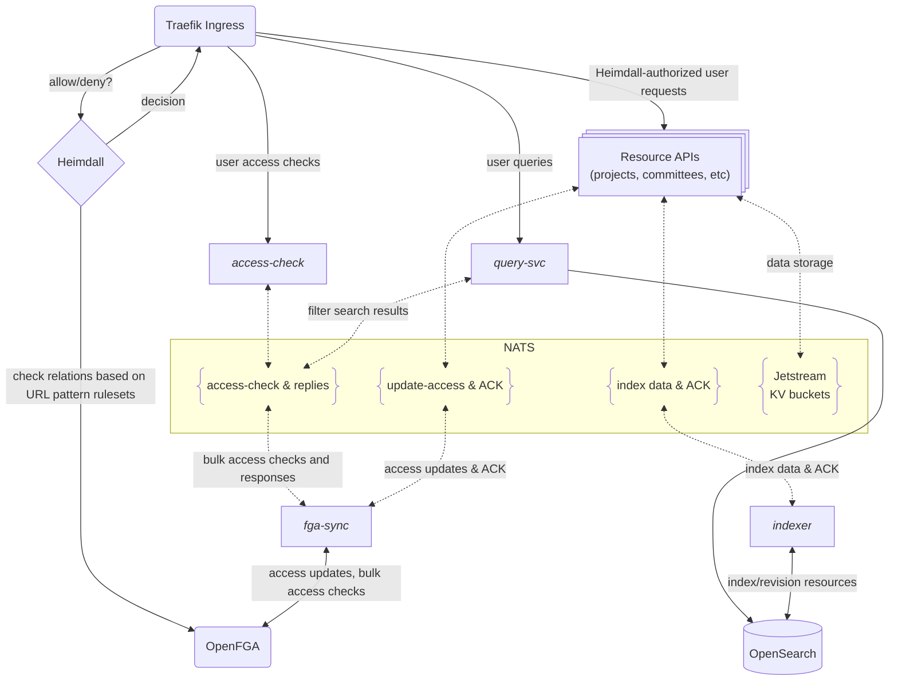

# LFX v2 Helm charts

This repository contains Helm charts for deploying the LFX v2 platform on Kubernetes.

## Repository structure

```text
lfx-v2-helm/
└── charts/
    └── lfx-platform/       # Main LFX Platform chart
        ├── templates/      # Kubernetes templates
        ├── Chart.yaml      # Chart metadata
        ├── values.yaml     # Default values
        └── README.md       # Documentation
```

## Installation

See the [lfx-platform chart README](./charts/lfx-platform/README.md) for
installation instructions.

## Components

The platform is composed of infrastructure components (Traefik, OpenFGA,
Heimdall, NATS, OpenSearch, and others) along with LFX platform services and
resource services. For the full list with links to each service repository, see
the [lfx-platform chart README](./charts/lfx-platform/README.md#subcharts).

## Component diagram



## Configuration

See the [lfx-platform chart README](./charts/lfx-platform/README.md) for configuration options and examples.

## Releases

This repository automatically publishes Helm charts to GitHub Container Registry (GHCR) when tags are created.

### Creating a Release

1. Merge pull requests that update chart manifests or configuration. Do not
   manually bump the `version` field in `charts/lfx-platform/Chart.yaml` — the
   release workflow sets the published chart version from the Git tag.
2. After the pull request is merged, create a GitHub release and choose the
   option for GitHub to also tag the repository. The tag can be anything, but
   the current convention is for the format `v{version}` (e.g., `v0.3.36`). The
   tag determines the chart version published to GHCR (e.g. tag `v0.3.36`
   publishes chart version `0.3.36`).
3. The GitHub Actions workflow will automatically:
   - Package the Helm chart
   - Publish it to `ghcr.io/linuxfoundation/lfx-v2-helm/chart`
   - Sign the chart with cosign for security
   - Generate SLSA provenance attestation

## Development

To contribute to this repository:

1. Fork the repository
2. Commit your changes to a feature branch in your fork. Ensure your commits
   are signed with the [Developer Certificate of Origin
   (DCO)](https://developercertificate.org/).
   You can use the `git commit -s` command to sign your commits.
3. Do not manually bump the `version` field in `charts/lfx-platform/Chart.yaml`
   — the release workflow sets the published chart version from the Git tag
   (see [Releases](#releases)).
4. If you are adding a new platform component, ensure it is documented in the
   [component diagram](#component-diagram) and the
   [lfx-platform chart README](./charts/lfx-platform/README.md#adding-a-new-subchart).
5. Run MegaLinter locally at the root of the working directory to check for
   errors or linting problems:
   ```bash
   docker run --rm --platform linux/amd64 \
     -v "$(pwd):/tmp/lint:rw" \
     oxsecurity/megalinter-documentation:v8
   ```
6. Submit your pull request

## License

Copyright The Linux Foundation and each contributor to LFX.

This project’s source code is licensed under the MIT License. A copy of the
license is available in `LICENSE`.

This project’s documentation is licensed under the Creative Commons Attribution
4.0 International License \(CC-BY-4.0\). A copy of the license is available in
`LICENSE-docs`.
